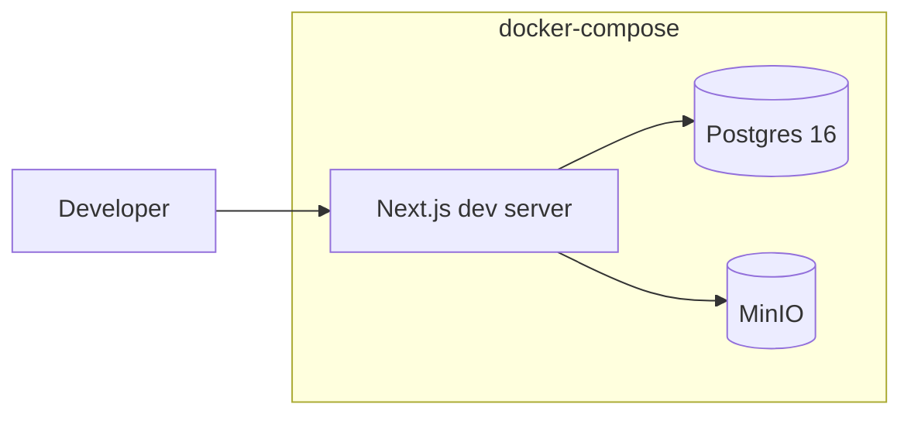
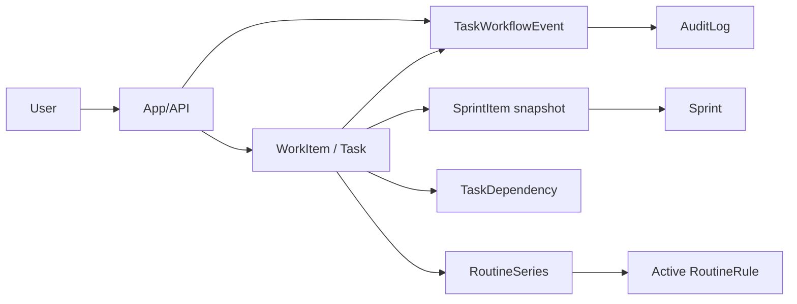
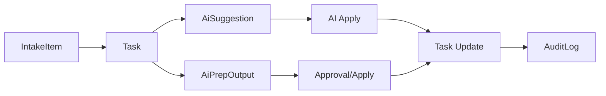

# Architecture (Draft)

## Production (AWS / EC2)
```mermaid
flowchart LR
  User[User/Client] --> ALB[ALB (HTTP)]
  subgraph AWS[VPC (ap-northeast-3)]
    ALB --> EC2[EC2 App (Next.js/Node + cron)]
    EC2 --> RDS[(RDS PostgreSQL)]
    EC2 --> S3[(S3 Avatar Bucket)]
    SM[Secrets Manager] --> EC2
    EC2 --> Metrics[Daily Metrics Job (uv + python, cron)]
    Metrics --> RDS
  end
```

## Local Dev (docker-compose)


## Processing Flows

### Plan/Execute/Review Navigation
```mermaid
flowchart LR
  Home[/] --> Backlog[/backlog (Plan)]
  Backlog --> Sprint[/sprint (Execute)]
  Sprint --> Review[/review (Review)]
  Review --> Backlog
```

### Work lifecycle and sprint planning


`Task.status` and `Task.sprintId` are compatibility projections. Execution
state comes from `workflowState`; capacity and historical reporting come from
`SprintItem`. See [work-item-domain.md](./work-item-domain.md).

### Daily Metrics -> Memory Update
```mermaid
flowchart LR
  Cron[EC2 cron] --> Job[Metrics Job (uv + python)]
  Job --> Read[Query Task + TaskWorkflowEvent]
  Read --> Metric[MemoryMetric (window)]
  Metric --> Claim[MemoryClaim (EMA)]
```

### AI Collaboration Flow


### Focus Queue Computation
```mermaid
flowchart LR
  Tasks[Tasks + Dependencies] --> Score[Priority Score]
  Metrics[MemoryMetric] --> Score
  Score --> Focus[FocusQueue (Top 3)]
```

## Module boundaries

- `app` and integration adapters import a module through `index.server`.
- Cross-module dependencies use only `index.ts` or `index.server.ts`; domain,
  application, and infrastructure directories are private to their module.
- Domain and application layers do not import Prisma, Next.js, or
  infrastructure code.
- The architecture check rejects cross-module internal imports and module
  dependency cycles.
