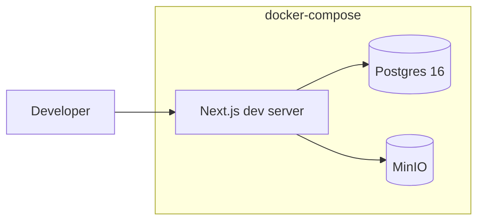
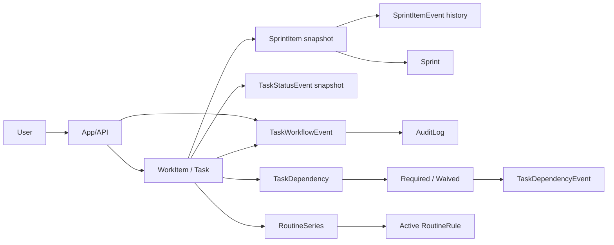
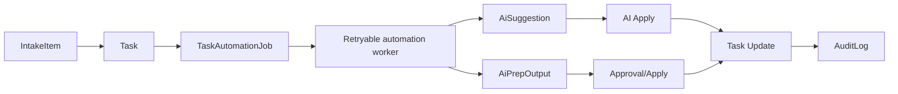
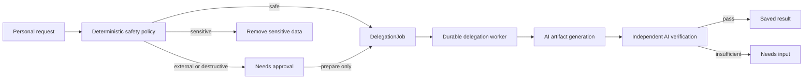

# Architecture

## Production (AWS / EC2)
```mermaid
flowchart LR
  User[User/Client] --> ALB[ALB (HTTP)]
  subgraph AWS[VPC (ap-northeast-3)]
    ALB --> EC2[EC2 App (Next.js/Node + durable job poller)]
    EC2 --> RDS[(RDS PostgreSQL)]
    EC2 --> S3[(S3 Avatar Bucket)]
    SM[Secrets Manager] --> EC2
    EC2 --> Metrics[Daily Metrics Job (uv + python, cron)]
    Metrics --> RDS
  end
```

## Local Dev (docker-compose)


## Processing Flows

### Plan/Execute/Review Navigation
```mermaid
flowchart LR
  Home[/] --> Backlog[/backlog (Plan)]
  Backlog --> Sprint[/sprint (Execute)]
  Sprint --> Review[/review (Review)]
  Review --> Backlog
```

### Work lifecycle and sprint planning


`Task.status` and `Task.sprintId` are compatibility projections. Execution
state comes from `workflowState`; capacity and historical reporting come from
`SprintItem`. See [work-item-domain.md](./work-item-domain.md).

### Daily Metrics -> Memory Update
```mermaid
flowchart LR
  Cron[EC2 cron] --> Job[Metrics Job (uv + python)]
  Job --> Read[Query TaskWorkflowEvent snapshots]
  Read --> Metric[MemoryMetric (window)]
  Metric --> Claim[MemoryClaim (EMA)]
```

### AI Collaboration Flow


### Personal delegation flow


The current executor is deliberately artifact-only. It cannot send, publish,
delete, modify files, or claim that an external operation happened. Those
capabilities must be added as scoped execution-port adapters with their own
authorization and idempotency rules. See
[personal-delegation.md](./personal-delegation.md).

### Focus Queue Computation
```mermaid
flowchart LR
  Tasks[Tasks + Dependencies] --> Score[Priority Score]
  Metrics[MemoryMetric] --> Score
  Score --> Focus[FocusQueue (Top 3)]
```

## Module boundaries

- `app` and integration adapters import a module through `index.server`.
- Cross-module dependencies use only `index.ts` or `index.server.ts`; domain,
  application, and infrastructure directories are private to their module.
- Domain and application layers do not import Prisma, Next.js, or
  infrastructure code.
- The architecture check rejects cross-module internal imports and module
  dependency cycles.
- General `Task` writes are statically restricted to the Tasks infrastructure.
  Cross-aggregate operations that must share a Sprint, Intake, AI, or Workspace
  transaction use the narrow shared consistency adapter; new direct table
  writers fail the architecture check.
- Lifecycle decisions are planned in the Tasks application layer and reused by
  single-item and bulk commands. Persistence adapters supply facts and apply
  the resulting plan.
- Task status history is written only through one shared snapshot adapter;
  dependency state and decision events are written only through the Task
  aggregate writer. The architecture check rejects bypasses.
- Task state-dependent reads and writes use one process-wide serializable
  transaction adapter with bounded conflict retries.
- AI provider calls are downstream of durable `TaskAutomationJob` records;
  successful task writes do not depend on provider availability. A Node
  instrumentation hook starts a non-overlapping poller, heartbeat-protects
  claims, recovers stale workers, and exposes queue degradation via health.
  Health classifies overdue PENDING and RUNNING jobs using independently
  configurable age thresholds; queue depth alone is not considered healthy.
- Personal delegation follows the same durable boundary through
  `DelegationJob`, but owns its policy, commands, runner, and adapters in the
  `modules/delegation` layers. Domain and application code do not depend on
  Prisma, Next.js, or the AI provider.
- Task list consumers follow the cursor until `hasMore` is false. Sprint views
  apply `sprintId` in the server query instead of loading workspace-wide DONE
  work and filtering it in the browser.
