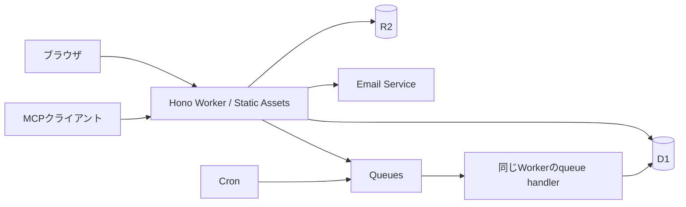

# 構成と開発上の境界

ViteでビルドしたSPAを Workers Static Assets から配信し、同じWorkerでAPIとMCPを扱う。
Nodeのlisten、常駐poller、PostgreSQL、Prisma、S3 SDK、SMTP、Python日次ランタイムは使わない。
CDは停止中。

```mermaid
flowchart LR
  Browser[ブラウザ] --> Worker[Hono Worker / Static Assets]
  MCP[MCPクライアント] --> Worker
  Worker --> D1[(D1)]
  Worker --> R2[(R2)]
  Worker --> Email[Email Service]
  Worker --> Queue[Queues]
  Cron[Cron] --> Queue
  Queue --> Consumer[同じWorkerのqueue handler]
  Consumer --> D1
```

| 場所 | 正本 |
| --- | --- |
| [app/main.tsx](../app/main.tsx) | 画面一覧と認証付き遷移 |
| [server/worker.ts](../server/worker.ts) / [wrangler.jsonc](../wrangler.jsonc) | fetch・queue・scheduled、bindings |
| [server](../server) | Hono、リクエスト文脈、API。ルート表は生成する |
| [modules](../modules) | 機能ごとのdomain / application / infrastructure |
| [lib/contracts](../lib/contracts) | WebとMCPの入力契約 |
| [migrations](../migrations) / [database](../database) | D1の制約・型・SQL保存口 |
| [scripts/check-architecture.mjs](../scripts/check-architecture.mjs) | 境界・循環・直接書き込みの検査 |

モジュール外は `index.ts` / `index.server.ts` を通す。
ブラウザは保存口やserverに依存せず、domain / applicationはD1・Honoに依存しない。
タスク・状態・依存・スプリントの履歴は専用の保存口を使う。

`db.command` は読取りと書込みを計画し、読んだテーブルのrevisionを検査してから
D1の一つのbatchでコミットする。競合時は有限回再計画する。
コールバック中に外部APIやメールを実行しない。制約違反ではbatch全体を戻す。
テーブル単位の検査なので、無関係な行の変更でも再試行する場合がある。

設定とDB sessionはイベントごとの文脈に置く。secretを `process.env` へコピーしない。
AIは永続ジョブの保存後に実行し、Queuesで起動、毎分Cronで滞留を回収する。
所有権・再試行・キャンセルをD1で管理し、日次指標はowner単位のQueueメッセージで処理する。
一覧はcursorを進め、スプリント画面は `sprintId` で絞る。
