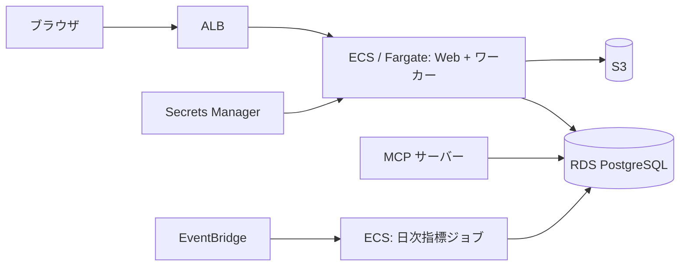

# 構成と開発上の境界

## 実行構成

ブラウザは Vite でビルドした SPA を使い、Hono の `/api/*` を呼ぶ。
Node サーバーが画面の配信、認証、API、永続ジョブのワーカーを担当する。
開発時は同じ `localhost:3000` から内部の Vite（`5173`）へ画面を転送する。

移行先は Cloudflare。現在の API は Node 向けで、Workers 対応は [次の課題](issues.md#cloudflare移行)。
CD は停止中。以下は [Terraform](../infra/terraform/README.md) に残る旧 AWS 配布構成。

```mermaid
flowchart LR
  Browser[ブラウザ] --> ALB[ALB]
  ALB --> Web[ECS / Fargate: Web + ワーカー]
  Web --> DB[(RDS PostgreSQL)]
  Web --> S3[(S3)]
  Secrets[Secrets Manager] --> Web
  MCP[MCP サーバー] --> DB
  Schedule[EventBridge] --> Metrics[ECS: 日次指標ジョブ]
  Metrics --> DB
```

ローカルでは RDS / S3 の代わりに Docker Compose の PostgreSQL / MinIO を使う。
MCP と Bot は Web とは別プロセス。配布依存は npm workspace と Docker ターゲットで分ける。

## コードの正本

| 場所 | 役割 |
| --- | --- |
| [app/main.tsx](../app/main.tsx) | React Router の画面一覧と認証付き遷移。`/` は `/delegate` へ移動 |
| [server](../server) | Hono の起動、リクエスト文脈、API。`routes/**/route.ts` からルート表を生成 |
| [modules](../modules) | 機能ごとの domain / application / infrastructure |
| [lib/contracts](../lib/contracts) | Web と MCP が共有する入力契約 |
| [prisma/schema.prisma](../prisma/schema.prisma) | 保存形式と参照関係 |
| [scripts/check-architecture.mjs](../scripts/check-architecture.mjs) | モジュール間の参照、循環、直接書き込みの検査 |

API ファイルを追加した場合は開発サーバーを再起動する。
ビルド・型チェック・`test:run` ではルート表を再生成する。

## 守る境界

- モジュール外からは `index.ts` / `index.server.ts` の公開口を使う。ブラウザは server 側や Prisma を参照しない。
- domain / application は Prisma、Hono、infrastructure に依存しない。
- タスクの単体・一括操作は同じ lifecycle planner を使い、状態に依存する読み書きを共通の Serializable transaction と有限回の再試行で行う。
- 状態・依存・スプリントの履歴は専用の保存口を通す。規則は [ドメイン](work-item-domain.md) に集約する。
- AI 呼び出しは永続ジョブの記録後に行う。常駐ワーカーは所有権、heartbeat、再試行、滞留回復を扱い、失敗・滞留はヘルスチェックへ反映する。
- 一覧の取得は `hasMore` がなくなるまでカーソルを進める。スプリント画面はサーバーで `sprintId` を絞る。

認証の互換性は [移行記録](vite-migration.md)、委譲と学習の仕様は
[委譲](personal-delegation.md) / [メモリ](user-memory.md) を参照。
